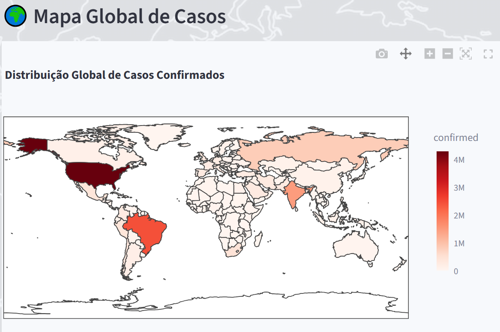
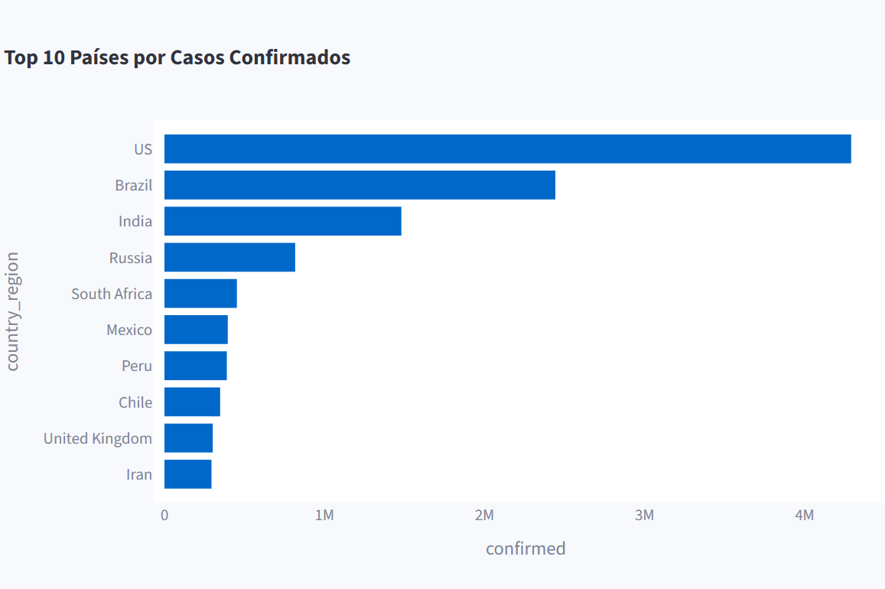

# Projeto Grupo 32 - SENAC

# 🌍 COVID Global Analysis Dashboard

Dashboard interativo para análise global da COVID-19, com foco comparativo no Brasil e visualização de indicadores epidemiológicos mundiais.

## 🚀 Deploy Online

👉 https://covid-global-analysis-college-work-f9jk9eordwqjmenngx7ayn.streamlit.app/

---

# 📊 Funcionalidades

✅ Dashboard interativo  
✅ Mapa global da COVID-19  
✅ Ranking dos países mais afetados  
✅ Destaque automático para o Brasil  
✅ Indicadores globais:
- Casos confirmados
- Mortes
- Recuperados
- Casos ativos
- Letalidade

✅ Filtros por região da OMS  
✅ Interface multilíngue:
- 🇧🇷 Português
- 🇺🇸 English
- 🇪🇸 Español
- 🇷🇺 Русский
- 🇨🇳 中文

✅ Visual moderno e responsivo  
✅ Deploy online com Streamlit Cloud  

---

# 🛠️ Tecnologias Utilizadas

- Python
- Pandas
- Plotly
- Streamlit
- NumPy
- Matplotlib

---

# 📁 Estrutura do Projeto

```bash
covid-global-analysis-college-work/
│
├── dashboard/
│   └── app.py
│
├── data/
│   ├── raw/
│   └── processed/
│
├── images/
│
├── notebooks/
│   └── eda.ipynb
│
├── requirements.txt
├── .gitignore
└── README.md
# 🌎 Fonte dos Dados

Dataset utilizado:

- Kaggle COVID-19 Dataset
- Our World in Data
- WHO (World Health Organization)

---

# 🎯 Objetivo do Projeto

O projeto tem como objetivo analisar comparativamente os impactos da COVID-19 entre países e regiões do mundo, permitindo visualizar padrões globais da pandemia e destacar a posição do Brasil em relação ao cenário internacional.

---

# 📌 Principais Análises

- Países com mais casos confirmados
- Países com mais mortes
- Taxa de recuperação
- Taxa de letalidade
- Comparação Brasil vs Mundo
- Distribuição global dos casos
- Indicadores por região da OMS

---

# 📷 Preview do Dashboard

## 🌍 Mapa Global



---

## 📈 Ranking de Países



---

# 📚 Projeto Acadêmico

Projeto desenvolvido para fins acadêmicos no curso de Análise e Desenvolvimento de Sistemas.